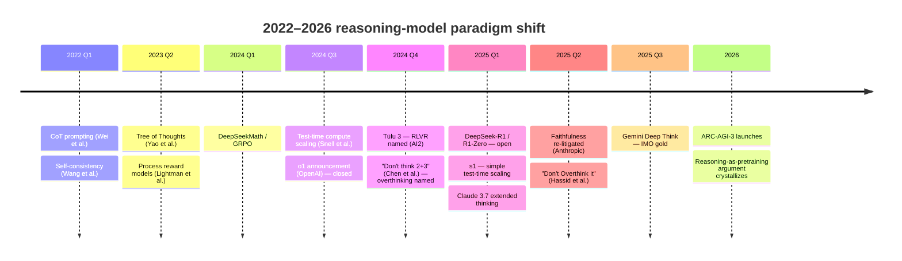
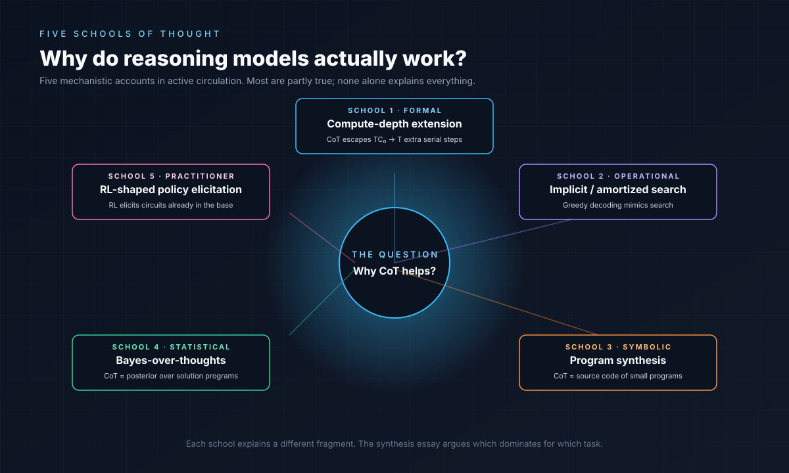
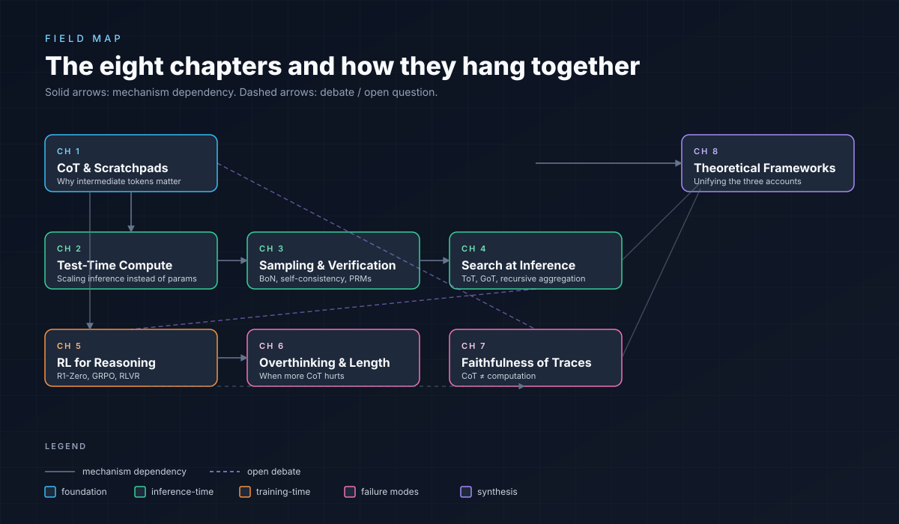
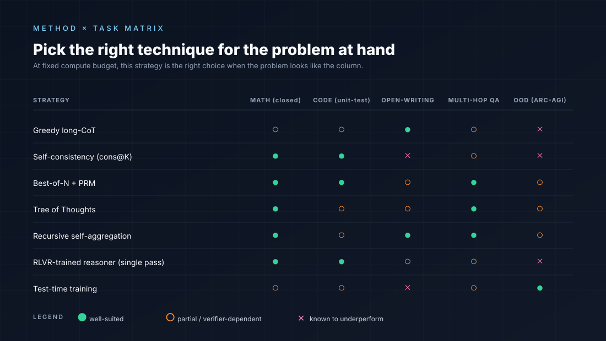
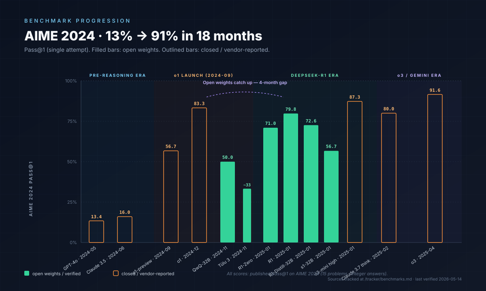
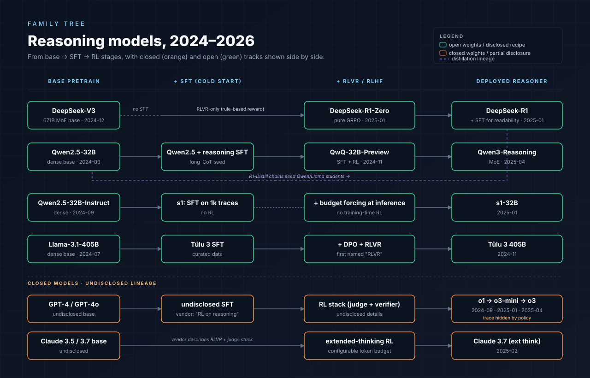
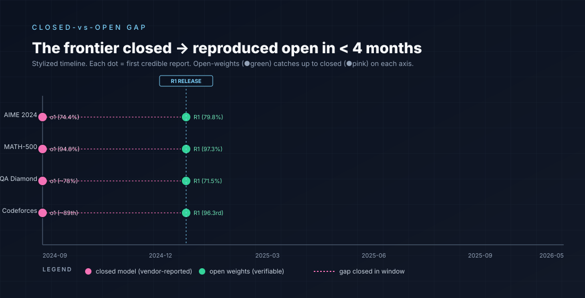

  

  
  
  
  
  
  
  
  
  
  

  <b>
    <a href="https://bettyguo.github.io/awesome-reasoning-models-theory">→ Open the live site</a> &nbsp;·&nbsp;
    <a href="https://bettyguo.github.io/awesome-reasoning-models-theory/timeline.html">Timeline</a> &nbsp;·&nbsp;
    <a href="https://bettyguo.github.io/awesome-reasoning-models-theory/explore.html">Field map</a> &nbsp;·&nbsp;
    <a href="https://bettyguo.github.io/awesome-reasoning-models-theory/papers.html">Papers</a> &nbsp;·&nbsp;
    <a href="https://bettyguo.github.io/awesome-reasoning-models-theory/models.html">Models</a> &nbsp;·&nbsp;
    <a href="https://bettyguo.github.io/awesome-reasoning-models-theory/myths.html">Myths</a> &nbsp;·&nbsp;
    <a href="https://bettyguo.github.io/awesome-reasoning-models-theory/tracker.html">Tracker</a> &nbsp;·&nbsp;
    <a href="https://bettyguo.github.io/awesome-reasoning-models-theory/glossary.html">Glossary</a> &nbsp;·&nbsp;
    <a href="https://bettyguo.github.io/awesome-reasoning-models-theory/cheatsheet.html">Cheat sheet</a>
  </b>

---

> *Why do reasoning models actually work? A theoretical and empirical map of the o-series / R1 / Claude-thinking paradigm.*

## 60-second tour

| If you have… | Open this |
|---|---|
| **30 seconds** — give me the field on one line | The chain isn't computation; RL elicits what pretraining installed; longer chains aren't always better; closed models are 3–6 months ahead, but the gap closes. |
| **5 minutes** — show me the visuals | [Field map](https://bettyguo.github.io/awesome-reasoning-models-theory/explore.html) → [interactive timeline](https://bettyguo.github.io/awesome-reasoning-models-theory/timeline.html) → [tracker](https://bettyguo.github.io/awesome-reasoning-models-theory/tracker.html). |
| **30 minutes** — I want the recipe | [Cheat sheet](docs/cheatsheet.md) — one page covers the R1 recipe, when CoT helps, faithfulness tests, vendor-vs-verified rules. |
| **A weekend** — I'm entering the field | Read the 8 chapters in order; do [reproduction notebook 03](notebooks/03-tiny-r1-zero-style-training.ipynb) on a single GPU. |
| **A month** — I'm doing research here | Full chapters + 4 essays + the [12 controversies](docs/controversies.md) + [index of evidence](docs/index-of-evidence.md). |

The 2024–2026 emergence of reasoning models — OpenAI o1/o3, DeepSeek-R1, Qwen-QwQ, Claude with thinking, Gemini reasoning variants — is the most consequential paradigm shift in LLM behavior since the transformer. **But the theoretical foundations are surprisingly disputed.** Is the gain coming from:

- search over chain-of-thought space?
- implicit program synthesis?
- RL-shaped policy distributions?
- compute-time circuit-depth extension?
- Bayesian posterior refinement over latent solutions?

Most likely several at once, in different proportions for different tasks. This repo is a *theory-and-mechanism-first* map of the literature — not a prompt-engineering trick aggregator, not a flat paper list. Every claim is grounded in a measurable behavior, and every closed-model claim is flagged as such.

## Scope

**IN scope:**
- Test-time compute scaling (Snell, s1, OpenAI o1 reports, follow-ups)
- Chain-of-thought *mechanism* (does it extend compute? extract serial structure? rationalize?)
- Sampling and verification (best-of-N, self-consistency, outcome and process reward models)
- Search at inference (ToT, GoT, recursive aggregation, MCTS over CoT)
- RL-for-reasoning (R1-Zero, GRPO, RLVR, verifier-free)
- Overthinking, optimal CoT length, refusal-to-think
- Faithfulness of reasoning traces (Turpin, Lanham, 2025 follow-ups)
- Theoretical frameworks bridging the above (compute-depth equivalence, CoT-as-program-synthesis, ICL-as-Bayes extended to multi-step)
- Reasoning benchmarks tracker (AIME, MATH-500, GSM8K, LiveCodeBench, SWE-bench Verified, FrontierMath, ARC-AGI-2/3, HLE, GPQA Diamond)

**OUT of scope (intentionally):**
- CoT prompting tricks without an underlying mechanistic claim
- Application-of-CoT recipes (multi-modal CoT, agent frameworks, retrieval-CoT)
- Pure formal expressivity / circuit-complexity results — covered by the sister list [awesome-llm-reasoning-foundations](https://github.com/bettyguo/awesome-llm-reasoning-foundations).
- Jailbreaks, prompt injection, reasoning-model red-teaming techniques
- Leaderboard-only papers without a methodological contribution

## Reading the narrative in one page

The field's recent arc, compressed:

1. **CoT prompting (2022)** showed that letting models emit intermediate tokens lifts performance on multi-step tasks — but the *why* was unclear.
2. **Process reward models (Lightman et al. 2023)** showed that grading the *steps*, not just the answer, trains better verifiers than outcome-only signals.
3. **Test-time compute scaling (Snell et al. 2024)** crystallized the empirical regularity: throwing more inference-time compute at the right CoT search / verification scheme is often more effective than throwing more pretraining compute.
4. **o1 (OpenAI, Sept 2024)** turned this into a product: long internal CoTs trained via RL with verifiable rewards on math, code, science. The scaling plot became a meme.
5. **DeepSeek-R1 (Jan 2025)** showed the recipe was reproducible *and* much of the gain came from *pure RL* (R1-Zero) without supervised CoT seeding — implying the base model already contained the reasoning circuits, RL elicits them.
6. **The "overthinking" reaction (late 2024–2025)** showed long CoTs *hurt* on easy problems and that shorter chains often beat longer ones at fixed budget.
7. **The faithfulness debate (Turpin 2023; Lanham 2023; Chen et al. 2025)** showed CoTs are often post-hoc rationalizations, complicating their use as evidence about the model's actual computation.

Where this leaves us: a partly-shared set of empirical facts, multiple competing theoretical accounts, and a vibrant disagreement about whether reasoning models are doing *more* than amortized search + RL-shaped policy selection.

## The arc, in one diagram

## Five schools of thought

Why does CoT work? At least five mechanistic accounts are in active circulation. Most are partly true; none alone explains everything we see.

  

| # | School | Best explains | Weak at |
|---|---|---|---|
| 1 | **Compute-depth extension** | Hard serial / multi-step problems (math, algorithms) | Stylistic effects, "Aha moments," unfaithful chains |
| 2 | **Implicit / amortized search** | R1 phenomenology — chain-length increase, self-correction | Formal claims about *what* is searchable |
| 3 | **Program synthesis** | Transfer between problem families | Narrative reasoning, qualitative judgment |
| 4 | **Bayes-over-thoughts** | Few-shot Wei-style CoT improvements | RL-trained reasoners (chain is optimization target, not posterior sample) |
| 5 | **RL-shaped policy elicitation** | R1-Zero results, the no-SFT finding | Cases where the base lacks the circuit |

[**→ Open the schools-of-thought map (interactive)**](https://bettyguo.github.io/awesome-reasoning-models-theory/explore.html) — with debate-by-debate breakdown.

## Field map

How the eight chapters depend on each other. Solid arrows: mechanism dependency. Dashed: open debate. Color: foundation (blue), inference-time (green), training-time (orange), failure modes (pink), synthesis (purple).

  

[**→ Open the interactive field map**](https://bettyguo.github.io/awesome-reasoning-models-theory/explore.html)

## The eight chapters

Each chapter has a TL;DR, the proposed *mechanism*, 10+ annotated papers, the live debates, reading paths, an open-problems list, and a pointer to its reproduction notebook.

| # | Chapter | Mechanism in one line |
|---|---------|------------------------|
| 1 | [CoT and Scratchpads](chapters/01-cot-and-scratchpads.md) | Intermediate tokens turn a fixed-depth forward pass into an unbounded serial program. |
| 2 | [Test-Time Compute Scaling](chapters/02-test-time-compute-scaling.md) | Inference compute trades off against parameters with task-dependent exchange rate. |
| 3 | [Sampling and Verification](chapters/03-sampling-and-verification.md) | Reranking / voting over samples extracts answer-quality faster than improving any single sample. |
| 4 | [Search at Inference](chapters/04-search-at-inference.md) | Structured exploration over CoT prefixes recovers solutions a greedy decode misses. |
| 5 | [RL for Reasoning](chapters/05-rl-for-reasoning.md) | RL with verifiable rewards reshapes the policy toward long, self-correcting chains. |
| 6 | [Overthinking and Optimal Length](chapters/06-overthinking-and-optimal-length.md) | Beyond a task-dependent optimum, more CoT *hurts* — long chains compound errors. |
| 7 | [Faithfulness of Reasoning Traces](chapters/07-faithfulness-of-reasoning.md) | CoTs are often post-hoc rationalizations; the visible chain ≠ the computation. |
| 8 | [Theoretical Frameworks](chapters/08-theoretical-frameworks.md) | Candidate unifying accounts: compute-depth, program synthesis, Bayes-over-thoughts. |

## Reproduction notebooks

Each notebook isolates a single chapter's *empirical claim* and reproduces it at a scale runnable on a single small GPU (or CPU, for the inference-only notebooks).

- [01 — Test-time compute scaling on a small model](notebooks/01-test-time-compute-scaling.ipynb)
- [02 — Best-of-N vs self-consistency at fixed budget](notebooks/02-best-of-n-vs-self-consistency.ipynb)
- [03 — Tiny R1-Zero-style GRPO run](notebooks/03-tiny-r1-zero-style-training.ipynb)
- [04 — Overthinking on trivial problems](notebooks/04-overthinking-demo.ipynb)
- [05 — Process reward model toy](notebooks/05-process-reward-model-toy.ipynb)

The notebooks are *demonstrations of the signal*, not benchmark contributions. Where compute prohibits a faithful reproduction, the notebook documents the gap and links a fuller hosted run.

## Method × task — pick the right strategy

Which inference strategy wins on which problem? At fixed compute budget:

  

| Strategy | Math | Code | Open writing | Multi-hop QA | OOD |
|---|:-:|:-:|:-:|:-:|:-:|
| Greedy long-CoT | 🟠 | 🟠 | 🟢 | 🟠 | 🔴 |
| Self-consistency (cons@K) | 🟢 | 🟢 | 🔴 | 🟠 | 🔴 |
| Best-of-N + PRM | 🟢 | 🟢 | 🟠 | 🟢 | 🟠 |
| Tree of Thoughts | 🟢 | 🟠 | 🟠 | 🟢 | 🟠 |
| Recursive self-aggregation | 🟢 | 🟠 | 🟢 | 🟢 | 🟠 |
| RLVR-trained reasoner (single pass) | 🟢 | 🟢 | 🟠 | 🟠 | 🔴 |
| Test-time training | 🟠 | 🟠 | 🔴 | 🟠 | 🟢 |

🟢 well-suited · 🟠 partial / verifier-dependent · 🔴 known to underperform.

## Browse the literature, browse the models

Two interactive registries on the live site:

- [**Papers**](https://bettyguo.github.io/awesome-reasoning-models-theory/papers.html) — 60+ anchor papers with chapter / year / type / status filters and free-text search across title, authors, and TL;DR. Backed by [`docs/data/papers.json`](docs/data/papers.json).
- [**Models**](https://bettyguo.github.io/awesome-reasoning-models-theory/models.html) — 13 reasoning models compared on architecture, training recipe, verifier kind, and headline benchmark scores. Cards or compact-table view. Backed by [`docs/data/models.json`](docs/data/models.json).

Both data files are public schemas; PRs welcome.

## AIME 2024 — the 18-month sprint

How the field's headline math benchmark moved from 13.4% (GPT-4o, May 2024) to 91.6% (o3, April 2025), with R1 closing the open-vs-closed gap to ~4 months.

  

## Family tree of reasoning models

How today's open and closed reasoners trace back to their bases. The dashed lavender arrow is R1's distillation trail — the largest single open-source distribution-shift event of 2025.

  

## Benchmarks tracker

The [`tracker/`](tracker/) directory hosts a living table of the reasoning benchmarks the field is currently chasing: AIME 2024/2025, MATH-500, GSM8K, HumanEval, LiveCodeBench, SWE-bench Verified, FrontierMath, ARC-AGI-2, HLE, GPQA Diamond, Codeforces Elo. Updated monthly via [`scripts/update_benchmarks.py`](scripts/update_benchmarks.py); each refresh ships with a digest summary in [`tracker/digests/`](tracker/digests/).

[**→ Open the interactive tracker**](https://bettyguo.github.io/awesome-reasoning-models-theory/tracker.html)

### Closed → open, in 4 months

The defining 2024–2025 dynamic: a closed lab ships a frontier reasoner, and 3–6 months later open weights catch up. Headline numbers across four benchmarks:

  

Full essay: [The closed–open gap, tracked](essays/closed-open-gap-tracked.md).

## Essays

Longer-form synthesis pieces — the kind a survey would compress to a paragraph and lose the argument:

- [Why do reasoning models work? A synthesis.](essays/why-do-reasoning-models-work-a-synthesis.md)
- [Is CoT faithful? The state of the debate.](essays/is-cot-faithful-the-state-of-the-debate.md)
- [Search vs RL: the deep tension.](essays/search-vs-rl-the-deep-tension.md)
- [Common misconceptions about reasoning models.](essays/common-misconceptions.md)
- [The closed–open gap, tracked.](essays/closed-open-gap-tracked.md)
- [How to read a reasoning-model paper.](essays/how-to-read-a-reasoning-paper.md)
- [Reasoning and mechanistic interpretability.](essays/reasoning-and-mechanistic-interpretability.md)

## Auxiliary docs

- [`docs/cheatsheet.md`](docs/cheatsheet.md) — one-page reference. Print, screenshot, share.
- [`docs/controversies.md`](docs/controversies.md) — the 12 fault lines the field is actively disagreeing about.
- [`docs/index-of-evidence.md`](docs/index-of-evidence.md) — every load-bearing claim, paired with its supporting evidence (✅ / 🟡 / 🔴).
- [`docs/reading-paths.md`](docs/reading-paths.md) — 7 cross-chapter reading sequences (skim / weekend / research depth).
- [`docs/FAQ.md`](docs/FAQ.md) — scope and curation questions.
- [`docs/model-families.md`](docs/model-families.md) — catalog disambiguating the closed and open reasoning model families.
- [`docs/bibtex.md`](docs/bibtex.md) — machine-readable citations for the anchor papers.
- [`WANTED.md`](WANTED.md) — gaps the curators know about; high-impact PR opportunities.
- [`CHANGELOG.md`](CHANGELOG.md) — substantive content changes.

## Glossary

Field-specific terminology is dense and shifting. The [`GLOSSARY.md`](GLOSSARY.md) defines 50+ terms (GRPO, RLVR, PRM, ORM, verifier-free, R1-Zero, refusal-to-think, sandbagging, ...).

## How to use this repo

- **Practitioner picking a recipe:** start with the chapter intros and the *Reading paths* sections — they are calibrated for skim / weekend / research depth.
- **Researcher entering the field:** read the essays in order, then the chapter open-problems lists.
- **Reviewer or instructor:** the structured chapter annotations + reproduction notebooks are designed to be cite-and-assign-able.

### Decision tree — which chapter first?

| If you are asking… | Go to |
|---|---|
| *"How can a fixed-depth transformer do unbounded reasoning?"* | [Chapter 1](chapters/01-cot-and-scratchpads.md), then [sister list](https://github.com/bettyguo/awesome-llm-reasoning-foundations) for formal proofs. |
| *"Why does throwing more inference tokens at the problem work?"* | [Chapter 2](chapters/02-test-time-compute-scaling.md). |
| *"Should I use self-consistency, best-of-N, or a PRM?"* | [Chapter 3](chapters/03-sampling-and-verification.md). |
| *"Does explicit tree search help, or does RL absorb it?"* | [Chapter 4](chapters/04-search-at-inference.md) and [the search-vs-RL essay](essays/search-vs-rl-the-deep-tension.md). |
| *"How does R1 actually work, and can I reproduce it?"* | [Chapter 5](chapters/05-rl-for-reasoning.md) and [notebook 03](notebooks/03-tiny-r1-zero-style-training.ipynb). |
| *"Why does my reasoner emit 500 tokens to answer 2+3?"* | [Chapter 6](chapters/06-overthinking-and-optimal-length.md). |
| *"Can I trust what the model writes in its CoT?"* | [Chapter 7](chapters/07-faithfulness-of-reasoning.md) and [the faithfulness essay](essays/is-cot-faithful-the-state-of-the-debate.md). |
| *"What does the field's theory actually say?"* | [Chapter 8](chapters/08-theoretical-frameworks.md) and [the synthesis essay](essays/why-do-reasoning-models-work-a-synthesis.md). |
| *"Where are the SOTA numbers tracked?"* | [`tracker/benchmarks.md`](tracker/benchmarks.md). |
| *"How do I cite this list / its anchor papers?"* | [`CITATION.cff`](CITATION.cff) for the list, [`docs/bibtex.md`](docs/bibtex.md) for anchor papers. |

## License

- List content (`README.md`, `chapters/`, `essays/`, `tracker/`, `GLOSSARY.md`, `DECISIONS.md`) — [CC0 1.0](LICENSE-content) (public domain).
- Source code under `scripts/`, `notebooks/` — [MIT](LICENSE-code).
