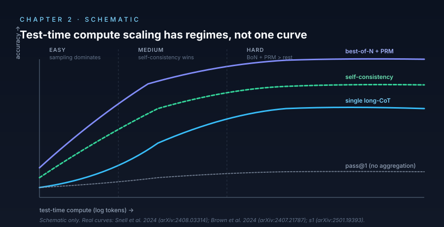

# Chapter 2 — Test-Time Compute Scaling

> *Inference compute trades off against parameters with task-dependent exchange rate.*

<p align="center">
  
</p>

## TL;DR

For a wide class of reasoning tasks, accuracy grows roughly log-linearly with inference-time compute (tokens emitted, samples drawn, search expansions), with a task-dependent exponent. Snell et al. (2024) formalized this as a *test-time compute scaling law* and showed that the optimal trade-off between training compute and inference compute is generally *not* "all training" — at some budget, allocating compute to inference dominates. The o1/o3 announcements ride this empirical claim; the open-source community has reproduced it on smaller models (s1, DeepSeek-R1's evaluation curves, Qwen-QwQ). But the law is regime-dependent: it saturates, it differs between inference strategies (BoN vs sequential refinement vs search), and on tasks without good verifiers it largely vanishes.

## The decision tree (which strategy at which budget)

```mermaid
flowchart TD
  Q{Verifier available?}
  Q -- "yes (math answer match, unit tests)" --> V1{How hard is the problem?}
  Q -- "no (open-ended)" --> N1[Single long-CoT;<br/>self-consistency rarely helps]

  V1 -- "easy" --> S1[Sequential sampling<br/>longer single CoT]
  V1 -- "medium" --> S2[Self-consistency<br/>cons@K, K≈16–64]
  V1 -- "hard" --> S3[Best-of-N + PRM<br/>or structured search]
  V1 -- "OOD (ARC-AGI)" --> S4[Test-time training<br/>or recursive aggregation]

  classDef hl fill:#0b1220,stroke:#38bdf8,color:#f8fafc;
  class Q,V1 hl;
```

> **Read this as.** The "test-time compute scaling law" is not a single curve — it is a *family* of curves with different exponents for different (verifier, difficulty) regimes. The right strategy at fixed budget depends on which leaf you land on.

## The mechanism

Hold the model fixed and turn one knob: number of inference-time tokens *T* the model is allowed to emit before committing to an answer. Three families of inference-time mechanisms each give a different return on *T*:

1. **Sequential sampling (longer single CoT).** Accuracy improves until the model exhausts useful chain content; past that, gains plateau or invert (overthinking, Ch 6). Returns scale roughly with `log T` until saturation.

2. **Parallel sampling + aggregation (self-consistency, best-of-N).** Sample *K = T / T₀* chains of length *T₀*, then aggregate. Accuracy as a function of *K*: with majority vote, scales as the probability mass on the right answer concentrates; with a good verifier (best-of-N), can approach `pass@K`. Diminishing returns past `K ≈ 16–64` for current models.

3. **Sequential refinement / search (ToT, GoT, MCTS over CoT).** Use intermediate compute to *guide* later sampling. In principle, search dominates parallel sampling on tasks where partial-solution quality is informative. In practice, the gain depends on having a useful step-level value function, which is hard to obtain.

Snell et al. (2024) show that on MATH, a *smart* allocation of test-time compute — choosing among these strategies based on problem difficulty — can substitute for a 14× larger model. On easy problems, sequential sampling dominates; on hard problems, BoN with a learned PRM dominates; on the hardest, structured search.

**Open vs closed reproductions.** OpenAI's o1 announcement (Sept 2024) plots accuracy on competition math and Codeforces against a log-x-axis labeled "test-time compute" — the now-iconic curve. *(closed-model, vendor-reported)* — no independent verification, no released model. Muennighoff et al. (2025) reproduce a qualitatively similar curve at much smaller scale (Qwen2.5-32B-Instruct with explicit budget forcing) and ship the code; that is the cleanest open evidence. DeepSeek-R1's reported scaling also clears the bar for open evidence.

**The exchange rate is not constant.** Snell et al.'s point is that test-time and training-time compute *interact*: a sufficiently strong base model needs less test-time compute per unit accuracy. Adding more test-time compute to a weak model has diminishing returns earlier. This is why the "exchange rate" varies: it depends on whose ratio you are computing and on which task. Treating it as a single law misses the regime structure.

**Where it fails.** On tasks without a good verifier (multi-paragraph creative writing, ambiguous-answer reasoning, long-horizon agentic tasks at 2026 capability), test-time compute scaling is weak. The mechanism *requires* either (a) majority-vote aggregation working, which presumes a single answer, or (b) a usable verifier, which much of human cognition lacks.

## Key papers

- **Scaling LLM Test-Time Compute Optimally Can Be More Effective Than Scaling Model Parameters** (2024) — *Snell, Lee, Xu, Kumar.* [arXiv:2408.03314](https://arxiv.org/abs/2408.03314).
  - **Contribution**: Empirical scaling law for test-time compute on MATH; shows that with optimal allocation, a base model + test-time compute beats a 14× larger model at fixed FLOP-equivalent budget.
  - **Why it matters**: The canonical "test-time scaling" paper. Defines the framework subsequent open-source reasoners reproduce.
  - **Status**: 🟢 Verified. Open evidence (Google's PaLM-2 family models, but with public methodology).

- **Learning to Reason with LLMs** (2024) — *OpenAI* (o1 announcement, Sept 12, 2024). [openai.com/index/learning-to-reason-with-llms](https://openai.com/index/learning-to-reason-with-llms/).
  - **Contribution**: Announces o1 and shows the test-time-compute scaling curve on AIME, Codeforces, GPQA. *(closed-model, vendor-reported)* — no released model, no test infrastructure, no independent verification possible.
  - **Why it matters**: The slide deck that triggered the reasoning-model wave. Read for context; do not cite as established empirical fact.
  - **Status**: 🟡 Vendor-reported. Treat as primary-source claim, not as evidence.

- **s1: Simple Test-Time Scaling** (2025) — *Muennighoff, Yang, Shi, Dziri, Liu, Riedmiller, Liang, Manning, Hashimoto.* [arXiv:2501.19393](https://arxiv.org/abs/2501.19393).
  - **Contribution**: Fine-tunes Qwen2.5-32B on 1,000 curated reasoning examples; introduces *budget forcing* (force the model to "Wait" and continue thinking past a budget threshold). Reproduces o1-style test-time scaling on AIME / MATH / GPQA at single-cluster scale, fully open.
  - **Why it matters**: The cleanest open reproduction of the o1 test-time-scaling phenomenon, with code, data, and model. The empirical anchor for everything else in this chapter.
  - **Status**: 🟢 Verified, open.

- **Large Language Monkeys: Scaling Inference Compute with Repeated Sampling** (2024) — *Brown, Juravsky, Ehrlich, Clark, Le, Ré, Mirhoseini.* [arXiv:2407.21787](https://arxiv.org/abs/2407.21787).
  - **Contribution**: Studies pass@K scaling: with many independent samples, a small open model on coding and math approaches the performance of much larger reasoners. Treats *coverage* of the answer distribution as the resource.
  - **Why it matters**: Shows the test-time scaling law has a "pass@K" form independent of any verifier — coverage suffices when answers are checkable.
  - **Status**: 🟢 Verified.

- **An Empirical Analysis of Compute-Optimal Inference for Problem-Solving with Language Models** (2024) — *Wu, Sun, Li, Welleck, Yang.* [arXiv:2408.00724](https://arxiv.org/abs/2408.00724).
  - **Contribution**: Independent of Snell et al., maps the inference-compute Pareto frontier across sequential vs parallel strategies on math benchmarks; finds the optimal strategy depends on problem difficulty in a predictable way.
  - **Why it matters**: Sister paper to Snell et al.; together they establish the regime structure of test-time scaling.
  - **Status**: 🟢 Verified.

- **DeepSeek-R1: Incentivizing Reasoning Capability in LLMs via Reinforcement Learning** (2025) — *DeepSeek-AI.* [arXiv:2501.12948](https://arxiv.org/abs/2501.12948).
  - **Contribution**: Trains R1-Zero and R1; releases models and reports the test-time-compute scaling curve on AIME-24/25, MATH-500, GPQA, LiveCodeBench. Best open evidence for the scaling claim at frontier scale.
  - **Why it matters**: Same shape as the o1 announcement's curve, on open-weight models, with reproducible inference. Pins down the empirical phenomenon as architecture-agnostic rather than OpenAI-specific.
  - **Status**: 🟢 Verified, open.

- **Towards Thinking-Optimal Scaling of Test-Time Compute for LLM Reasoning** (2025) — *Yang et al.* [arXiv:2502.18080](https://arxiv.org/abs/2502.18080).
  - **Contribution**: Argues that the optimal *length* of CoT is task-dependent; develops training-time techniques to make a model emit shorter chains on easy problems and longer on hard ones, improving the compute-per-accuracy frontier.
  - **Why it matters**: Bridges this chapter and Chapter 6 (overthinking). Test-time scaling is not "more is better" but "more, calibrated to difficulty".
  - **Status**: 🟢 Verified.

- **Compute-Optimal Sampling: A New Paradigm for Inference Compute Scaling** (2024) — *part of the Wu et al. line; see also* [arXiv:2410.06180](https://arxiv.org/abs/2410.06180) *and related.*
  - **Contribution**: Sample weaker models more times instead of stronger models fewer times — under verifier-bounded budgets, the weak+many strategy dominates on many tasks.
  - **Why it matters**: Practical scaling recipe. Validates the "Monkeys" framing on broader benchmarks.
  - **Status**: 🟡 Multiple overlapping papers in this line; cite the version closest to your task.

- **Inference-Time Scaling for Generalist Reward Modeling** (2025) — *Liu et al.* [arXiv:2504.02495](https://arxiv.org/abs/2504.02495).
  - **Contribution**: Shows that scaling inference compute also helps the *reward model* / verifier in best-of-N pipelines. The standard test-time scaling law extends to the verifier side, not just the generator.
  - **Why it matters**: Identifies an under-explored axis: budget allocation between generator and verifier. Becomes load-bearing once verifiers become learned (PRMs, Ch 3).
  - **Status**: 🟢 Verified.

- **The Surprising Effectiveness of Test-Time Training for Abstract Reasoning** (2024) — *Akyurek et al.* [arXiv:2411.07279](https://arxiv.org/abs/2411.07279).
  - **Contribution**: On ARC-AGI, a *different* form of test-time compute — gradient updates on each test prompt — produces large gains, surpassing pure CoT scaling. Generalizes "test-time compute" beyond inference-only.
  - **Why it matters**: Reminds readers that "test-time compute" admits multiple instantiations; the field's default focus on sampling/search is a choice, not the only path.
  - **Status**: 🟢 Verified.

## Debates

- **Universal scaling law vs regime-dependent.** Snell et al. and Wu et al. converge on a *regime-dependent* picture: which strategy scales best depends on problem difficulty. The "universal law" framing in some popular accounts is misleading; defenders concede this when pressed.

- **How much of the test-time scaling gain is just better verifiers?** Brown et al. (Large Language Monkeys) and Lightman et al. (Ch 3) suggest a lot. If you have pass@K coverage and a perfect verifier, you can solve almost anything to within base-model coverage. Critics: this redefines the gain as a verifier gain, not a reasoning gain. The 2025 inference-time RM scaling work pushes back: verifier scaling and generator scaling are both real and partially independent.

- **Does the law hold for verifier-poor tasks?** Empirically, no — test-time scaling on creative writing, open-ended QA, long-horizon agent tasks is weak. Whether this is a fundamental limit or a "we don't have good verifiers yet" gap is debated. Akyurek et al. (test-time training) suggests an alternative: at-inference gradient updates may help where sampling doesn't.

- **Open vs closed reproduction.** o1's headline scaling curve is closed; s1 and R1 are open. Most slides showing "the o1 curve" should show R1 or s1 instead — same phenomenon, verifiable.

## Where to start

- **Skim path (90 min)**: Snell et al. → s1 (Muennighoff et al.) → Large Language Monkeys.
- **Deep path (1 weekend)**: + Wu et al. (compute-optimal inference), DeepSeek-R1 §3 (test-time scaling figures), Yang et al. (thinking-optimal), Liu et al. (inference RM scaling).
- **Research path**: full chapter + Akyurek et al. (test-time training) + the Ch 3 verifier-side literature.

## Reproduction

- **Notebook**: [`notebooks/01-test-time-compute-scaling.ipynb`](../notebooks/01-test-time-compute-scaling.ipynb).
- **What it shows**: On a small open math-tuned model (e.g. Qwen2.5-Math-1.5B) evaluated on a MATH-500 sample, accuracy grows log-linearly with the per-question token budget up to a saturation point. Qualitative reproduction of the Snell et al. / s1 curve at single-A10G scale.

## Open problems

- **A closed-form predictor of which strategy dominates at a given task and budget.** Snell et al. show one exists empirically; no theoretical derivation exists.
- **Test-time scaling under imperfect verifiers.** Real PRMs are noisy. How does scaling degrade as verifier accuracy drops? Partial answer in Rohatgi et al. (2025, Ch 3).
- **Whether the test-time scaling phenomenon transfers to agent / long-horizon tasks.** Largely negative as of 2026, but evidence is thin.
- **The role of test-time *training* (Akyurek et al.) as an alternative scaling axis.** Underexplored; promising on ARC-AGI and structured-reasoning benchmarks.

---

*Previous: [Chapter 1 — CoT and Scratchpads](01-cot-and-scratchpads.md). Next: [Chapter 3 — Sampling and Verification](03-sampling-and-verification.md).*
