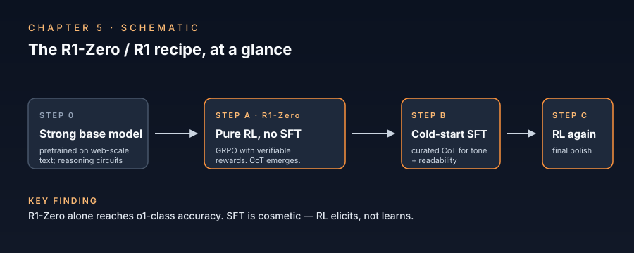

# Chapter 5 — RL for Reasoning

> *RL with verifiable rewards reshapes the policy toward long, self-correcting chains.*

  

## TL;DR

The dominant 2024–2026 recipe for producing a reasoning model: take a strong base, run RL with verifiable rewards (RLVR) on tasks with cheap correctness signals (math problems with known answers, code with unit tests). The DeepSeek-R1 result (Jan 2025) was the field's shock: doing this with *no* supervised CoT seed — pure RL from the base, "R1-Zero" — produces a strong reasoner. The chain-of-thought *emerges* during RL; specifically, it lengthens, becomes self-correcting, and develops "Aha moments" where the model notices its own mistake mid-chain. GRPO (Shao et al. 2024) replaced PPO as the workhorse algorithm. Open reproductions (Tulu 3, SimpleRL, Open-Reasoner-Zero) confirm the recipe is not DeepSeek-specific.

## The mechanism

**The setup.** Base model π₀ → policy π trained to maximize E[r(question, completion)] where r is `1` if the answer is correct, `0` otherwise (or a continuous proxy from a verifier). Tasks: math problems with extractable answers, code with executable tests, sometimes symbolic logic puzzles. RLVR sidesteps the reward-model bottleneck of RLHF — no learned reward, no preference labels.

**Why it works (the proposed mechanism, partly confirmed):**

1. The base model already contains the reasoning circuits. Pretraining on web-scale data exposes it to enough worked solutions that the relevant computations exist somewhere in the policy distribution, but at low probability under default decoding.
2. RLVR is an *elicitation* procedure, not a *learning* one. It moves probability mass onto the reasoning paths that *already* lead to correct answers more often, and away from paths that don't.
3. Because the reward is final-answer-only, the optimization is free to use the intermediate tokens however it wants. It "discovers" that emitting longer chains with explicit self-correction (`"Wait, let me reconsider..."`) raises the success rate. This is the *emergent chain behavior* DeepSeek documented.

**What R1-Zero showed.** No SFT, no human reasoning demonstrations. Just RL from the base. The model:
- Spontaneously increases chain length during training.
- Develops self-correction ("Aha moments").
- Mixes languages in its chain (a side effect of base distribution).
- Reaches o1-class performance on AIME with a public training recipe.

The "no SFT" point is load-bearing. It refutes the prior hypothesis that reasoning required curated CoT demonstrations.

**Why R1 (post-Zero) was needed.** R1-Zero's chains were strong on accuracy but unreadable (language mixing, sometimes garbled). R1 adds a cold-start SFT pass on a few thousand high-quality chains followed by another RL round. This is *cosmetic* refinement, not capability: R1-Zero already had the reasoning.

**GRPO and why it caught on.** PPO's value function is expensive; for verifiable rewards it is often poorly calibrated. GRPO (Group Relative Policy Optimization, from the DeepSeekMath paper) replaces it with a group-relative normalization: for each prompt, sample G completions, normalize advantages within the group, no value head needed. Cheap, stable, ships well with open-source infrastructure.

**RLVR vs RLHF for reasoning.** RLVR has a clean signal (verifier) and a structured task (one right answer). RLHF has a noisy learned reward and is meant for open-ended preferences. RLVR is what makes the reasoning-model recipe work; RLHF is for tone and helpfulness. The two are not interchangeable.

**The credit-assignment puzzle.** RLVR rewards final-answer correctness. The chain has many tokens; only the last few directly determine the answer. Why does the policy update the chain in the right ways? Two non-exclusive answers:
1. Long horizons + advantage estimation propagate credit backwards. With enough samples and the right baseline, GRPO/PPO can attribute reward across the chain.
2. The chain's correctness is *causal* for the answer: long correct chains are more likely to produce correct answers than long wrong chains. So increasing the probability of correct chains is the implicit objective.

Neither is fully settled. PRMs (Ch 3) offer a step-level alternative, but R1's success with outcome-only rewards is the evidence that step labels are not required.

## Key papers

- **DeepSeekMath: Pushing the Limits of Mathematical Reasoning in Open Language Models** (2024) — *Shao, Wang, Zhu, Xu, Song, Bi, Zhang, Zhang, Li, Wu, Guo.* [arXiv:2402.03300](https://arxiv.org/abs/2402.03300).
  - **Contribution**: Introduces Group Relative Policy Optimization (GRPO). Trains DeepSeekMath-Instruct via GRPO and shows strong math performance.
  - **Why it matters**: The GRPO origin. Read this before R1.
  - **Status**: 🟢 Verified.

- **DeepSeek-R1: Incentivizing Reasoning Capability in LLMs via Reinforcement Learning** (2025) — *DeepSeek-AI.* [arXiv:2501.12948](https://arxiv.org/abs/2501.12948).
  - **Contribution**: R1-Zero (pure RL from base) and R1 (cold-start SFT + RL + SFT-then-RL refinement). Public-weights, openly described pipeline reaching o1-class results.
  - **Why it matters**: The defining paper of the era. Annotations should focus on the *aha moment* analysis, the language-mixing side effect, and the no-SFT-needed point — not on benchmark numbers.
  - **Status**: 🟢 Verified, open.

- **Tülu 3: Pushing Frontiers in Open Language Model Post-Training** (2024) — *Lambert, Morrison, Pyatkin, Huang, Ivison, Brahman, Miranda, Liu, Dziri, Lyu, Gu, Malik, Graf, Hwang, Yang, Bras, Tafjord, Wilhelm, Soldaini, Smith, Wang, Dasigi, Hajishirzi.* [arXiv:2411.15124](https://arxiv.org/abs/2411.15124).
  - **Contribution**: Open-recipe post-training including RLVR. Introduces the name "RLVR" for the verifiable-reward training family.
  - **Why it matters**: The earliest *named* RLVR recipe in the open. Concurrent with R1's research, predates the R1 release.
  - **Status**: 🟢 Verified.

- **The N+ Implementation Details of RLHF with PPO** / **The N Implementation Details of RLVR** — *Huang et al., HuggingFace TRL team.* Blog series and TRL docs.
  - **Contribution**: The non-obvious gotchas of stable RL training at scale (KL targeting, advantage normalization, value clipping, off-policy correction). Required reading before you reproduce R1.
  - **Why it matters**: Saves weeks of debugging. The unglamorous part of why the open community caught up.
  - **Status**: 🟢 Verified, see HuggingFace TRL repo.

- **Stream of Search (SoS): Learning to Search in Language** (2024) — *Gandhi et al.* [arXiv:2404.03683](https://arxiv.org/abs/2404.03683).
  - **Contribution**: Train models on synthetic search traces to make them perform search inline. Predates R1 in showing that search-like behavior is *trainable* rather than only injectable at inference.
  - **Why it matters**: Pre-R1 evidence that the "internalize the search loop" intuition works.
  - **Status**: 🟢 Verified.

- **Reasoning-as-Reinforcement-Learning is the New Pretraining** — *Lambert, Interconnects* and concurrent perspective pieces (2025).
  - **Contribution**: Frames the R1-era recipe as a *new pretraining paradigm*: scale RLVR like you used to scale next-token prediction.
  - **Why it matters**: Forces the conceptual reframing. If true, the field's compute allocation should shift accordingly.
  - **Status**: 🟡 Perspective piece; cite for context, not as established result.

- **SimpleRL / OpenRLHF / Open-Reasoner-Zero / verl** — open-source R1 reproductions (2025).
  - **Contribution**: Several independent reimplementations of the R1 recipe on smaller models (Qwen-7B, Mistral-7B). Confirm the recipe works without DeepSeek-specific infrastructure.
  - **Why it matters**: The cluster of mid-2025 reproductions that established R1 as a recipe, not a one-off.
  - **Status**: 🟢 Verified across multiple repos; check GitHub at addition time.

- **The Surprising Agreement Between Convex Optimization Theory and Learning Rate Scheduling in Deep Learning** — *background relevant to RL stability.*
  - **Contribution**: General-purpose background on optimizer behavior — cited because RL stability is mostly an optimizer-tuning problem.
  - **Why it matters**: Not reasoning-specific but worth knowing.
  - **Status**: 🟢 N/A — supporting reference.

- **Scaling Laws for Reward Model Overoptimization** (2022) — *Gao, Schulman, Hilton.* [arXiv:2210.10760](https://arxiv.org/abs/2210.10760).
  - **Contribution**: As you push RL harder against a learned reward, the policy diverges from the true objective. Predicts the inverse-U pattern with KL.
  - **Why it matters**: The cleanest pre-RLVR result on the overoptimization phenomenon. Becomes load-bearing once RLVR pipelines start using *learned* verifiers (PRMs as rewards), reintroducing the issue.
  - **Status**: 🟢 Verified.

- **ReFT: Reasoning with Reinforced Fine-Tuning** (2024) — *Luong, Zhang, Nguyen, Cai, Yang, Vu.* [arXiv:2401.08967](https://arxiv.org/abs/2401.08967).
  - **Contribution**: Combine SFT on math chains with PPO-style fine-tuning on the same answers. Pre-R1 demonstration that RL on math improves reasoning without supervised CoT for every step.
  - **Why it matters**: Predecessor to the R1 recipe; informs how much of R1's gain is attributable to RL vs to the choice of base model.
  - **Status**: 🟢 Verified.

- **Back to Basics: Revisiting REINFORCE-Style Optimization for Learning from Human Feedback in LLMs** (2024) — *Ahmadian et al.* [arXiv:2402.14740](https://arxiv.org/abs/2402.14740).
  - **Contribution**: Shows that plain REINFORCE (with a simple leave-one-out baseline — RLOO) matches PPO on RLHF benchmarks. Strong evidence that the PPO machinery is over-engineered for many LLM RL settings.
  - **Why it matters**: Demystifies the algorithm-choice question. GRPO, RLOO, and REINFORCE++ all work; the algorithm is not the load-bearing variable.
  - **Status**: 🟢 Verified.

- **KTO: Model Alignment as Prospect Theoretic Optimization** (2024) — *Ethayarajh, Xu, Muennighoff, Jurafsky, Kiela.* [arXiv:2402.01306](https://arxiv.org/abs/2402.01306).
  - **Contribution**: Aligns LLMs from binary (good / bad) feedback rather than pairwise preferences, using a loss inspired by Kahneman–Tversky prospect theory. Cheaper labeling.
  - **Why it matters**: Adjacent to RLVR — both replace pairwise preferences with simpler signal forms. KTO with verifiable correctness as the "good" signal is a viable RLVR alternative.
  - **Status**: 🟢 Verified.

## Debates

- **R1-Zero implies reasoning is elicitation, not learning. Does it generalize?** R1-Zero works because the Qwen / DeepSeek base contains the relevant circuits. Open question: does R1-Zero-style pure RL work on weaker bases? Empirically yes for some, no for others. The threshold for "base strong enough" is not characterized.

- **GRPO vs simpler alternatives.** RLOO, REINFORCE++, and plain REINFORCE with smart baselines all report comparable results to GRPO on the open reasoning benchmarks. GRPO is not provably the best algorithm; it is the *first* algorithm that worked at frontier scale.

- **RLVR vs RLHF for reasoning.** Most agree RLVR is the right tool for verifiable tasks. The question is whether *most* reasoning is verifiable. For math/code, yes; for open-ended reasoning, less clear. Pure RLHF has been mostly abandoned for reasoning.

- **Process reward models in RL training.** Lightman et al. (Ch 3) show PRMs are better verifiers; using them as reward signals in RLVR is the obvious step. Empirically, results are mixed: PRMs in the reward loop sometimes destabilize training. R1 used outcome-only rewards; this remains the conservative default.

- **Reward hacking.** As verifier-policy capability gaps close, the policy finds ways to make the verifier say "correct" without being correct. Mitigations: stricter answer parsers, ensemble verifiers, no-judge held-out checks. Open problem area.

## Where to start

- **Skim path (90 min)**: DeepSeekMath (GRPO) → DeepSeek-R1 §3-4 (recipe + ahas) → Tülu 3 §4 (RLVR).
- **Deep path (1 weekend)**: + ReFT (Luong et al.), Stream of Search (Gandhi et al.), one open-source R1 reproduction codebase (SimpleRL or verl).
- **Research path**: full chapter + Gao et al. (overoptimization) + Liu et al. (verifier scaling, Ch 3) + the open problems on reward hacking.

## Reproduction

- **Notebook**: [`notebooks/03-tiny-r1-zero-style-training.ipynb`](../notebooks/03-tiny-r1-zero-style-training.ipynb).
- **What it shows**: A scaled-down GRPO run on a tiny model (e.g. Qwen2.5-0.5B) with GSM8K math problems. Demonstrates the *signal*: chain length increases, the format reward is gameable, the math reward is sparse but tractable. Full training requires more compute than a single small GPU; the notebook links a hosted reproduction.

## Open problems

- **The base-model threshold for R1-Zero-style pure RL.** No characterization exists.
- **Whether RLVR generalizes outside the math/code regime.** Anthropic and others are working on this; results are early.
- **Mechanistic understanding of the "aha moment" emergence.** Activation-level analyses are sparse as of 2026.
- **Reward hacking under PRMs.** Active area; expect a wave of papers in 2026–2027.
- **The compute-allocation between cold-start SFT and RL.** R1's recipe is empirically tuned; no theory.

---

*Previous: [Chapter 4 — Search at Inference](04-search-at-inference.md). Next: [Chapter 6 — Overthinking and Optimal Length](06-overthinking-and-optimal-length.md).*
