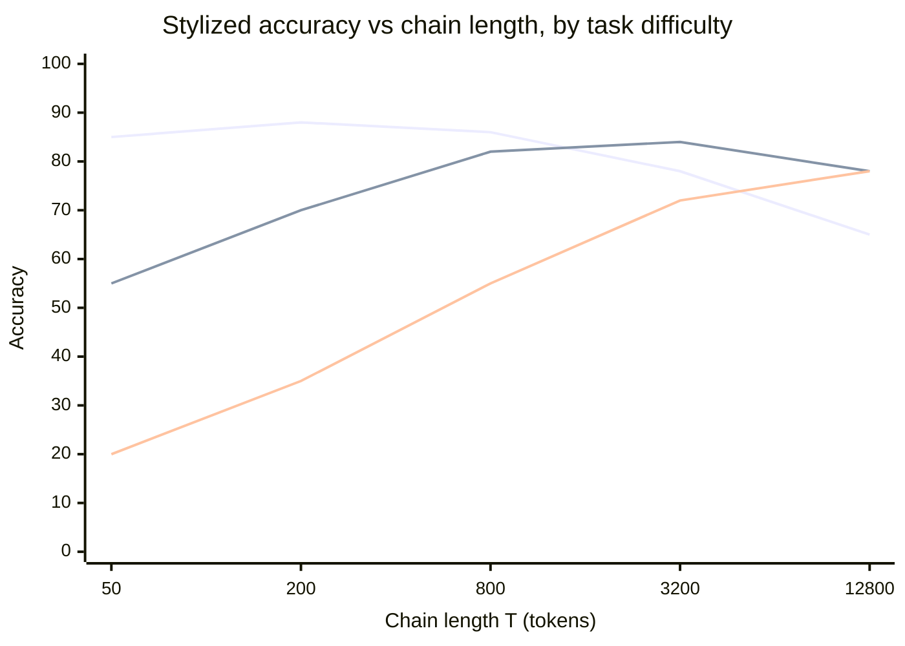

# Chapter 6 — Overthinking and Optimal Length

> *Beyond a task-dependent optimum, more CoT hurts — long chains compound errors.*

## TL;DR

The 2024–2025 reaction to the "more thinking is better" framing: longer chains routinely *hurt* accuracy on easy problems, and shorter chains often match or beat longer ones on hard problems at fixed budget. Chen et al. (2024) coined "overthinking" with the canonical example: ask a reasoning model `"2 + 3 = ?"` and watch it emit 200+ tokens of reconsideration. "Don't Overthink it" (2025) shows preference-modeling toward shorter chains as a training fix. The mechanism is plausible: each additional reasoning step has a non-zero error rate; chains compound. The optimal chain length is task-dependent — both flooring it and cap-ping it must respect this.

## The optimum, in one diagram

> **Read this as.** Each task class has its own *optimum*. Easy tasks peak at short chains and degrade past it (the overthinking regime). Hard tasks have a much higher optimum but also asymptote. **A reasoner that always emits maximum-length chains is mis-allocated for ~⅔ of typical workloads.** The "thinking-optimal scaling" line of work (Yang 2025) is about finding the optimum per problem instead of using a fixed default.

## The mechanism

Each reasoning step is a stochastic operation with some error probability ε per step. A T-step chain that requires *every* step to be correct has success probability `(1-ε)^T` — exponentially decaying in T. With self-correction the picture is friendlier (the model can recover from a wrong step), but the basic intuition stands: more steps means more opportunities for accumulated error if the model doesn't course-correct.

**Empirical patterns:**

- On easy problems (single-step arithmetic, simple lookups), models with strong reasoning training emit very long chains anyway, and the answer is often correct *despite* the chain, not because of it. Chen et al. document a 30%+ rate of "the model arrives at the right answer mid-chain and then talks itself out of it."

- On hard problems, longer chains help up to a saturation point and then plateau or invert. The saturation point depends on the task and the model.

- Different *training recipes* produce different chain-length distributions for the same task. R1-style RL produces longer chains on average than self-consistency-trained baselines.

**Why long chains hurt — three non-exclusive theories:**

1. **Compound error.** Each step has non-zero ε; T steps stack up.
2. **Self-doubt cascade.** The model emits "wait, let me reconsider" tokens which, when conditioned on, change the policy's distribution over the answer. Sometimes the policy then commits to a wrong reconsideration.
3. **Format reward gaming.** RLVR-trained reasoners may have learned a soft preference for long chains because long chains correlate with correctness in training, not because long chains *cause* correctness.

The three predict different remedies — see open problems.

**Why short chains can match long chains on hard problems.** Mathematical results are often *terse*. A 50-token correct proof outperforms a 5000-token meandering one. Shorter chains constrain the policy to commit; longer chains permit hedging. The 2025 "shorter is better" papers find that *training-time* preference for shorter chains, with verifier-confirmed correctness, produces calibration improvements at no accuracy cost — sometimes accuracy gain.

**The refusal-to-think failure mode.** Less-discussed but real: reasoning models sometimes emit a perfunctory short chain on a hard problem when they should have engaged. The Chen et al. framing emphasizes overthinking; the inverse (underthinking) is symmetric.

## Key papers

- **Do Not Think That Much for 2+3=? On the Overthinking of o1-Like LLMs** (2024) — *Chen, Xu, Zhang, Zhang, Shi, Wang, Zhang, Wu, Ren, Jin, Hu, Wu.* [arXiv:2412.21187](https://arxiv.org/abs/2412.21187).
  - **Contribution**: First paper to systematically document "overthinking" in o1-style models: long chains on trivial problems, with measurable accuracy degradation. Defines outcome-/process-overthinking metrics.
  - **Why it matters**: The naming paper for the phenomenon. The 2+3 example is now standard rhetoric.
  - **Status**: 🟢 Verified.

- **Don't Overthink it. Preferring Shorter Thinking Chains for Improved LLM Reasoning** (2025) — *Hassid et al.* [arXiv:2505.17813](https://arxiv.org/abs/2505.17813).
  - **Contribution**: Trains policies via DPO on (shorter-and-correct, longer) preference pairs; shows accuracy gains and substantial chain-length reductions.
  - **Why it matters**: The cleanest training-time fix; concrete recipe.
  - **Status**: 🟢 Verified.

- **Towards Thinking-Optimal Scaling of Test-Time Compute for LLM Reasoning** (2025) — *Yang et al.* [arXiv:2502.18080](https://arxiv.org/abs/2502.18080).
  - **Contribution**: Argues for *task-conditional* chain length: short on easy problems, long on hard. Training-time intervention to make the model calibrate.
  - **Why it matters**: The principled framing of the issue. Bridges Ch 2 (test-time scaling) and this chapter.
  - **Status**: 🟢 Verified.

- **Chain of Draft: Thinking Faster by Writing Less** (2025) — *Xu, Liu, Chen, Ma, Su, Diao, Hong, Yao.* [arXiv:2502.18600](https://arxiv.org/abs/2502.18600).
  - **Contribution**: Prompt format change — "use ≤5 words per step" — recovers most accuracy at a fraction of the tokens.
  - **Why it matters**: Demonstrates how much of CoT length is filler. Cheap inference-time intervention; complementary to Hassid et al.'s training-time fix.
  - **Status**: 🟢 Verified.

- **s1: Simple Test-Time Scaling** (2025) — *Muennighoff et al.* [arXiv:2501.19393](https://arxiv.org/abs/2501.19393).
  - **Contribution**: Introduces *budget forcing* — controlled cap on the thinking budget — and shows it as a knob with non-trivial trade-off shape, including an *under*-thinking regime where forcing the model to think longer (by suppressing end-of-thought) increases accuracy on hard problems.
  - **Why it matters**: The most explicit demonstration that the length-accuracy curve is non-monotonic and that the operating point matters.
  - **Status**: 🟢 Verified.

- **Stop Overthinking: A Survey on Efficient Reasoning for Large Language Models** (2025) — *Sui et al.* [arXiv:2503.16419](https://arxiv.org/abs/2503.16419).
  - **Contribution**: Comprehensive survey of efficient-reasoning methods; taxonomizes approaches (training, inference, prompting) for shortening chains while preserving accuracy.
  - **Why it matters**: The canonical recent survey for this chapter. Useful index.
  - **Status**: 🟢 Verified.

- **Inverse Scaling: When Bigger Isn't Better** (2023) — *McKenzie et al.* TMLR. [arXiv:2306.09479](https://arxiv.org/abs/2306.09479).
  - **Contribution**: Catalogs tasks on which larger models are *worse*. Some examples (e.g. NeQA) are predictive of reasoning-model overthinking patterns: larger/more-trained models confidently produce wrong answers via plausible chains.
  - **Why it matters**: Context for "more capacity hurts" claims. Not all overthinking is about chain length; some is about training-distribution mismatch.
  - **Status**: 🟢 Verified.

- **When More Thinking Hurts** (cluster of 2025–2026 papers).
  - **Contribution**: A line of work documenting cases where chain extension hurts even on hard tasks — e.g. on certain logic puzzles, the longer the chain, the more likely the model is to adopt a wrong assumption and reason confidently from it.
  - **Why it matters**: Forces the chapter's framing away from "overthinking = easy problems" toward "overthinking = any case where chain length is misallocated."
  - **Status**: 🟡 Pending — the master prompt's reference (`arXiv:2604.10739`) needs verification.

- **The Lessons of Long-CoT Failure** — *several 2025 papers on specific failure modes.*
  - **Contribution**: Document specific patterns: wrong-assumption-anchoring, language-drift, premature commitment, infinite-self-doubt loops.
  - **Why it matters**: Categorizes the failure modes. Useful for diagnostic work.
  - **Status**: 🟡 Cluster of papers; cite by case.

- **Compute-Optimal Reasoning: Adjusting Chain Length to Difficulty** (concept; multiple instantiations 2025).
  - **Contribution**: A family of approaches that train or condition the model on a difficulty estimate and allocate chain length accordingly.
  - **Why it matters**: Practical recipe for production deployment.
  - **Status**: 🟡 Cite specific paper at integration time.

## Debates

- **Overthinking vs underthinking.** Most papers emphasize overthinking; the s1 budget-forcing work shows under-thinking is also real. The right framing is *length-misallocation*, not *too much thinking*.

- **Length-as-symptom vs length-as-cause.** Some argue long chains are a *symptom* of the model not knowing the answer — and shortening the chain via training masks this without fixing the underlying capability. Others (Hassid et al., Yang et al.) argue length is itself causal: long chains create more error opportunities. Probably both, by task.

- **Training-time fixes vs inference-time prompting fixes.** Chain-of-draft (prompt-only) and "Don't overthink it" (training-time DPO) achieve similar effects. The training-time approach is more durable but more expensive; the prompt-only approach is fragile to format changes.

- **Is the test-time scaling law incompatible with overthinking?** No, but it requires careful reading. The scaling law (Ch 2) is *averaged* over problem difficulty; overthinking is a *per-problem* phenomenon. The optimum allocation, per Yang et al., is *condition-on-difficulty* scaling.

## Where to start

- **Skim path (90 min)**: Chen et al. (overthinking origin) → Hassid et al. (training fix) → Xu et al. (chain of draft).
- **Deep path (1 weekend)**: + Yang et al. (thinking-optimal scaling), s1 §3-4 (budget forcing), Sui et al. (efficient-reasoning survey).
- **Research path**: full chapter + the "when more thinking hurts" cluster + connect to Ch 2 (test-time scaling).

## Reproduction

- **Notebook**: [`notebooks/04-overthinking-demo.ipynb`](../notebooks/04-overthinking-demo.ipynb).
- **What it shows**: On trivially easy problems (`2 + 3`, single-digit arithmetic, factual lookups), a small reasoning-trained model emits long chains and reaches wrong answers measurably more often than its base. Reproduces the Chen et al. qualitative finding on a tiny scale.

## Open problems

- **A predictor of optimal chain length given task and model.** Yang et al. is a partial answer; not closed-form.
- **Whether shortening chains via training degrades the *capability* on hard problems.** Mixed results; need controlled experiments at frontier scale.
- **Inverse failure modes (refusal-to-think, premature commitment).** Less-studied; symmetric to overthinking.
- **The interaction with reward hacking.** Some long chains are evidence of the policy gaming a format reward, not of real reasoning. Distinguishing the two requires mechanistic analysis.

---

*Previous: [Chapter 5 — RL for Reasoning](05-rl-for-reasoning.md). Next: [Chapter 7 — Faithfulness of Reasoning Traces](07-faithfulness-of-reasoning.md).*
